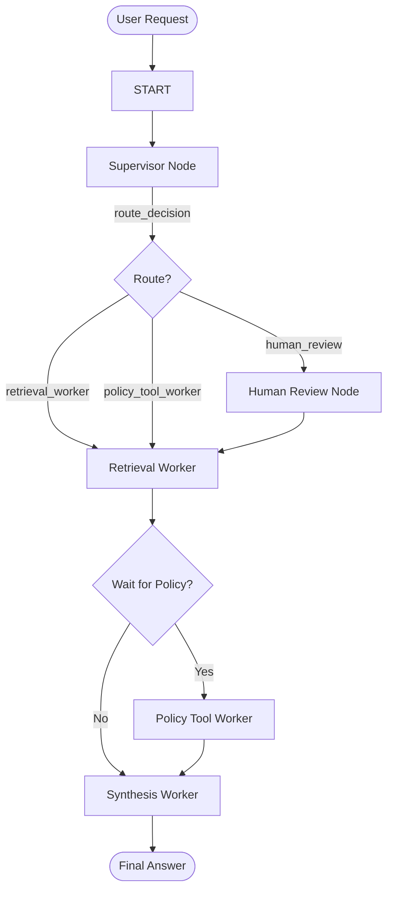

# System Architecture — Lab Day 09

**Nhóm:** VinUni-D9-L9  
**Ngày:** 2026-04-14  
**Version:** 1.0 (LangGraph Implementation)

---

## 1. Tổng quan kiến trúc

Hệ thống được thiết kế theo pattern **Supervisor-Worker** sử dụng framework **LangGraph**. Thay vì một Agent duy nhất phải đảm nhận mọi vai trò, chúng tôi tách biệt các khả năng thành các "chuyên gia" (Workers) và một "người điều phối" (Supervisor).

**Pattern đã chọn:** Supervisor-Worker (Stateful Graph)  
**Lý do chọn pattern này (thay vì single agent):**
- **Tính module:** Dễ dàng phát triển, test và bảo trì từng worker độc lập (Retrieval, Policy, Synthesis).
- **Tính minh bạch (Observability):** Quy trình ra quyết định được log rõ ràng qua `route_reason` và `history` trong từng bước của graph.
- **Xử lý phức tạp:** Dễ dàng thực hiện các tác vụ multi-hop (ví dụ: lấy context trước rồi mới kiểm tra policy).
- **Khả năng mở rộng:** Có thể thêm các worker mới (ví dụ: Finance Worker) mà không làm loãng prompt của các worker hiện tại.

---

## 2. Sơ đồ Pipeline

Hệ thống sử dụng LangGraph để quản lý luồng trạng thái (AgentState). Luồng đi được định nghĩa chặt chẽ nhưng linh hoạt qua các cạnh có điều kiện (conditional edges).

---

## 3. Vai trò từng thành phần

### Supervisor (`graph.py`)

| Thuộc tính | Mô tả |
|-----------|-------|
| **Nhiệm vụ** | Phân tích ý định người dùng nà phân loại task vào các domain tương ứng. |
| **Input** | `task` (câu hỏi của user) |
| **Output** | `supervisor_route`, `route_reason`, `risk_high`, `needs_tool` |
| **Routing logic** | Dựa trên keyword (hoàn tiền -> policy, SLA -> retrieval) và độ rủi ro (emergency -> human review). |
| **HITL condition** | Khử lỗi lạ (ERR-xxx) hoặc các yêu cầu khẩn cấp mức độ cao. |

### Retrieval Worker (`workers/retrieval.py`)

| Thuộc tính | Mô tả |
|-----------|-------|
| **Nhiệm vụ** | Tìm kiếm thông tin liên quan từ Knowledge Base (ChromaDB). |
| **Embedding model** | Jina AI (jina-embeddings-v5-text-small) |
| **Top-k** | 3 - 5 (tùy cấu hình .env) |
| **Stateless?** | Yes |

### Policy Tool Worker (`workers/policy_tool.py`)

| Thuộc tính | Mô tả |
|-----------|-------|
| **Nhiệm vụ** | Kiểm tra các quy tắc ngoại lệ và gọi công cụ ngoài (MCP). |
| **MCP tools gọi** | `search_kb`, `get_ticket_info`, `check_access_permission`, `create_ticket`. |
| **Exception cases xử lý** | Flash Sale, Sản phẩm kỹ thuật số, Đã kích hoạt, Temporal scoping (v3 vs v4). |

### Synthesis Worker (`workers/synthesis.py`)

| Thuộc tính | Mô tả |
|-----------|-------|
| **LLM model** | Groq (llama-3.1-8b-instant hoặc llama-3.3-70b-versatile) |
| **Temperature** | 0.1 (đảm bảo tính grounded, không hallucinate) |
| **Grounding strategy** | Strict System Prompt: "Chỉ trả lời dựa trên context được cung cấp". |
| **Abstain condition** | Nếu `retrieved_chunks` trống hoặc không chứa thông tin cần thiết. |

### MCP Server (`mcp_server.py`)

| Tool | Input | Output |
|------|-------|--------|
| search_kb | query, top_k | chunks, sources, total_found |
| get_ticket_info | ticket_id | ticket status, priority, assignee, SLA |
| check_access_permission | access_level, role, emergency | can_grant, required_approvers, notes |
| create_ticket | priority, title, description | ticket_id, url, timestamp |

---

## 4. Shared State Schema

Sử dụng `AgentState` làm "bảng nhớ tạm" chung xuyên suốt Graph.

| Field | Type | Mô tả | Ai đọc/ghi |
|-------|------|-------|-----------|
| task | str | Câu hỏi đầu vào của người dùng | Supervisor đọc |
| supervisor_route | str | Worker được supervisor lựa chọn | Supervisor ghi |
| history | Annotated[list, operator.add] | Ghi lại dấu vết thực thi (append-only) | Toàn bộ các Node ghi |
| retrieved_chunks | list | Danh sách bằng chứng tìm được | Retrieval ghi, Synthesis đọc |
| policy_result | dict | Kết quả phân tích chính sách | Policy ghi, Synthesis đọc |
| mcp_tools_used | list | Log các lần gọi tool ngoài | Policy ghi |
| final_answer | str | Câu trả lời cuối cùng gửi user | Synthesis ghi |
| confidence | float | Độ tin cậy của câu trả lời | Synthesis ghi |

---

## 5. Lý do chọn Supervisor-Worker so với Single Agent (Day 08)

| Tiêu chí | Single Agent (Day 08) | Supervisor-Worker (Day 09) |
|----------|----------------------|--------------------------|
| Debug khi sai | Khó — phải soi log LLM cực khổ | Dễ — Trace tách bạch từng node |
| Thêm capability mới | Prompt ngày càng phình to và dễ mất tập trung | Chỉ cần cắm thêm node mới vào Graph |
| Routing visibility | Phụ thuộc hoàn toàn vào "tâm trạng" của LLM | Rõ ràng qua `route_reason` và logic supervisor |
| Hiệu năng | Chậm vì xử lý tuần tự mọi thứ | Có thể tối ưu hóa luồng đi (bypass worker không cần thiết) |

---

## 6. Giới hạn và điểm cần cải tiến

1. **Phụ thuộc vào Supervisor:** Nếu Supervisor nhận diện sai Task ngay từ đầu, cả Graph sẽ đi sai hướng.
2. **Độ trễ (Latency):** Việc đi qua nhiều Node có thể làm tăng thời gian phản hồi so với Single Agent trong các task đơn giản.
3. **Quản lý State cực đoan:** Với các workflow quá lớn, `AgentState` có thể trở nên quá tải dữ liệu. Cần cơ chế dọn dẹp (state clean-up).
