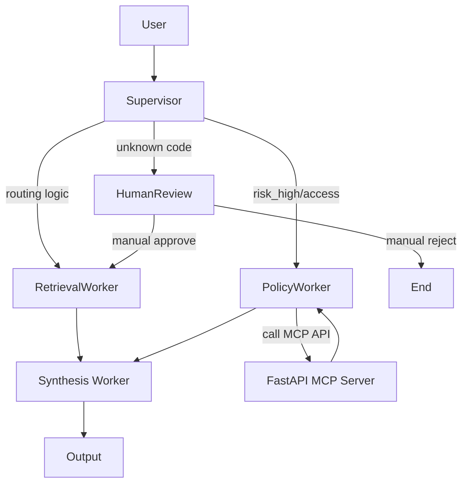

# System Architecture — Lab Day 09

**Nhóm:** Nhóm 10 / Trần Khánh Băng  
**Ngày:** 14/04/2026  
**Version:** 1.0

---

## 1. Tổng quan kiến trúc

> Mô tả ngắn hệ thống của nhóm: chọn pattern gì, gồm những thành phần nào.

**Pattern đã chọn:** Supervisor-Worker  
**Lý do chọn pattern này (thay vì single agent):**
Kiến trúc này cho phép tách tách biệt luồng xử lý dựa trên loại yêu cầu và mức độ rủi ro, phân quyền minh bạch hơn, linh hoạt trong việc cấu hình thêm Worker. Khi câu hỏi chạm đến vùng cấm (ticket nội bộ, database system level), nó dễ dàng rẽ nhánh HITL thay vì trả lời mơ hồ hoặc lạc đề như mô hình cũ.

---

## 2. Sơ đồ Pipeline

> Vẽ sơ đồ pipeline dưới dạng text, Mermaid diagram, hoặc ASCII art.
> Yêu cầu tối thiểu: thể hiện rõ luồng từ input → supervisor → workers → output.

**Ví dụ (ASCII art):**
```
User Request
     │
     ▼
┌──────────────┐
│  Supervisor  │  ← route_reason, risk_high, needs_tool
└──────┬───────┘
       │
   [route_decision]
       │
  ┌────┴────────────────────┐
  │                         │
  ▼                         ▼
Retrieval Worker     Policy Tool Worker
  (evidence)           (policy check + MCP)
  │                         │
  └─────────┬───────────────┘
            │
            ▼
      Synthesis Worker
        (answer + cite)
            │
            ▼
         Output
```

**Sơ đồ thực tế của nhóm:**



---

## 3. Vai trò từng thành phần

### Supervisor (`graph.py`)

| Thuộc tính | Mô tả |
|-----------|-------|
| **Nhiệm vụ** | Định tuyến yêu cầu của người dùng tới Worker hoặc HITL. |
| **Input** | User task, AgentState. |
| **Output** | supervisor_route, route_reason, risk_high, needs_tool |
| **Routing logic** | Keyword-based matching kèm flag `risk_high` dựa trên dictionary định sẵn. |
| **HITL condition** | Trigger nếu câu hỏi rơi vào tập hợp `risk_high` + `unknown error code/auth`. |

### Retrieval Worker (`workers/retrieval.py`)

| Thuộc tính | Mô tả |
|-----------|-------|
| **Nhiệm vụ** | Trích xuất và vector search lấy Context từ ChromaDB (day09_docs). |
| **Embedding model** | `sentence-transformers/all-MiniLM-L6-v2` |
| **Top-k** | 3 hoặc 5 tùy chỉnh theo collection search. |
| **Stateless?** | Yes |

### Policy Tool Worker (`workers/policy_tool.py`)

| Thuộc tính | Mô tả |
|-----------|-------|
| **Nhiệm vụ** | Phân tích vấn đề liên quan tới Policy, SLA thông qua việc gọi HTTP API. |
| **MCP tools gọi** | Các tools khai báo trong FastAPI `/tools` (search_kb, ticket info). |
| **Exception cases xử lý** | Auth failed hoặc tool call invalid được bắt exception nội bộ gán `mcp_tools_used`. |

### Synthesis Worker (`workers/synthesis.py`)

| Thuộc tính | Mô tả |
|-----------|-------|
| **LLM model** | Groq (`llama3-8b-8192` hoặc theo Model ENV) qua OpenAI Interface. |
| **Temperature** | 0.0 (Dùng RAG đòi hỏi tính ổn định và ground truth) |
| **Grounding strategy** | Đưa Context (từ mảng chunk/policy) vào prompt hệ thống để tổng hợp và trích dẫn. |
| **Abstain condition** | Khi Context hoàn toàn rỗng hoặc điểm score similarity trung bình quá thấp. |

### MCP Server (`mcp_server.py`)

| Tool | Input | Output |
|------|-------|--------|
| search_kb | query, top_k | chunks, sources |
| get_ticket_info | ticket_id | ticket details |
| check_access_permission | access_level, requester_role | can_grant, approvers |
| calculate_refund | order_id, amount | refund metrics |

---

## 4. Shared State Schema

> Liệt kê các fields trong AgentState và ý nghĩa của từng field.

| Field | Type | Mô tả | Ai đọc/ghi |
|-------|------|-------|-----------|
| task | str | Câu hỏi đầu vào | supervisor đọc |
| supervisor_route | str | Worker được chọn | supervisor ghi |
| route_reason | str | Lý do route | supervisor ghi |
| retrieved_chunks | list | Evidence từ retrieval | retrieval ghi, synthesis đọc |
| policy_result | dict | Kết quả kiểm tra policy | policy_tool ghi, synthesis đọc |
| mcp_tools_used | list | Tool calls đã thực hiện | policy_tool ghi |
| final_answer | str | Câu trả lời cuối | synthesis ghi |
| confidence | float | Mức tin cậy | synthesis ghi |
| risk_high | bool | Nhận diện rủi ro bảo mật | supervisor ghi, HITL đọc |
| hitl_triggered | bool | Trạng thái Human-in-The-Loop đã can thiệp | supervisor/hitl ghi |
| messages | list | Lưu trữ log trao đổi giữa agent và hệ thống. | System write/read |

---

## 5. Lý do chọn Supervisor-Worker so với Single Agent (Day 08)

| Tiêu chí | Single Agent (Day 08) | Supervisor-Worker (Day 09) |
|----------|----------------------|--------------------------|
| Debug khi sai | Khó — không rõ lỗi ở đâu | Dễ hơn — test từng worker độc lập |
| Thêm capability mới | Phải sửa toàn prompt | Thêm worker/MCP tool riêng |
| Routing visibility | Không có | Có route_reason trong trace |
| Security/Safety | Phụ thuộc hoàn toàn vào system prompt | Chia layer policy + MCP để tự review, và bật HITL |

**Nhóm điền thêm quan sát từ thực tế lab:**
Routing rất hiệu quả giúp giảm Hallucination ở các query SLA mang tính con số rườm rà. Code tổ chức thành các file riêng cho phép team Dev 1 có thể làm MCP trong khi Dev 2 code Router.

---

## 6. Giới hạn và điểm cần cải tiến

> Nhóm mô tả những điểm hạn chế của kiến trúc hiện tại.

1. Tốc độ pipeline khá chậm do cần tốn 1 nhịp điều hướng trước khi thực thi lệnh.
2. Supervisor dùng pattern dựa trên IF/ELSE (hoặc Keyword), chưa tận dụng một AI Controller Classifier độc lập và scale được nên tốn thêm công maintain bộ list keywords.
3. Việc quản lý State trên LangGraph khá cứng (schema `TypedDict` chặt chẽ) dẫn tới khi cần pass thêm nhiều tuỳ biến dynamic thì phải khai báo rườm rà từ đầu.
